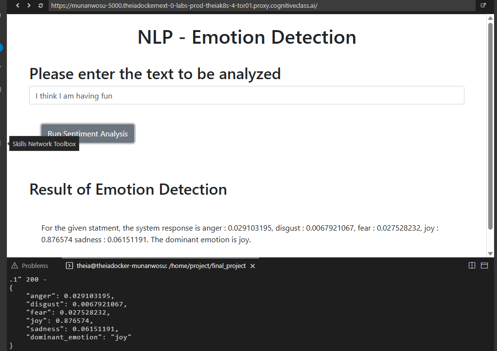

# Emotion Detector Flask Project(IBM Watson)
---

A simple web application that uses **IBM Watson’s NLP Emotion Analysis API** to detect emotions (joy, sadness, anger, fear, disgust). 

# How it's Made
---
## ***Tech Used***: IBM Watson’s NLP Emotion Analysis API, HTML, CSS, Javascript, Python, Flask

Users enter any text into a simple web form built with HTML and Flask templates. The text is sent to IBM Watson’s Emotion Analysis API using the requests library.The API responds with a JSON object containing emotion confidence scores for each emotion. The result is diplayed on a local server.

# Final Output
---

